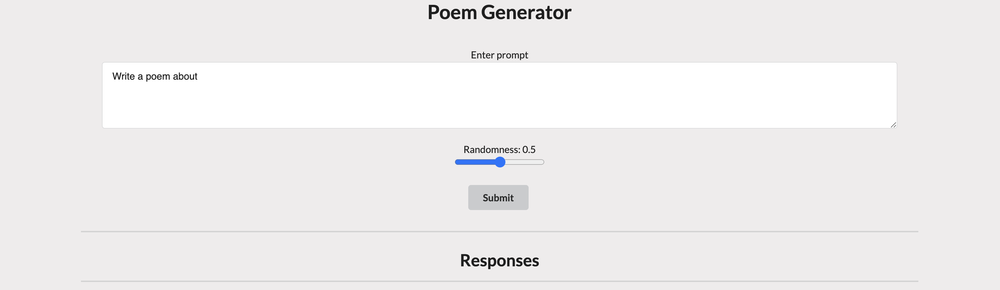
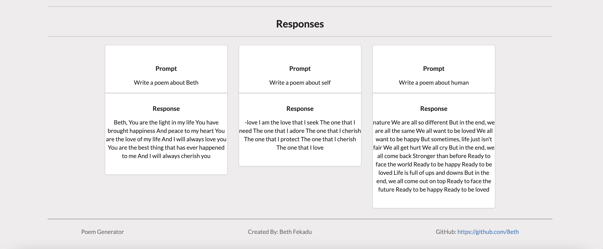

# Poem Generator
This application is used to generate poems based on user's input.

## Deployed App
https://my-poem-generator.herokuapp.com/

## Front End
The front-end of the website is built using React. `npm start` runs the app in the development mode. Open [http://localhost:3000](http://localhost:3000) to view it in the browser.

## APIs used
The application does a fetch request to GPT-3, a powerful AI model created by [OpenAI](https://openai.com/api/).

## User Stories
The application allows the user to 
  * Enter a prompt to choose the topic of a poem
  * Choose randomness of AI response
  * Recieve a poem based on prompt
  * View prompt and poem as a list of cards

## Styling
This application uses the following for styling
  * Semantic UI
  * Custom css

## User Input

## User Response

## Author
Beth Fekadu
  * GitHub: https://github.com/8eth 
  * Linkedin: https://www.linkedin.com/in/beth-fekadu